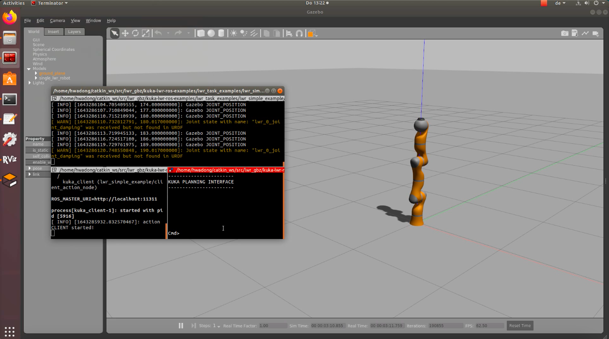

# Robot_Control

## Introduction

This ROS package is a modified version of the [Project Laboratory Human Centered Robotics](https://github.com/BernardoBrogi/Project-Laboratory). Based on that, the learning-based shared control approach is implemented, providing haptic guidance to the human operator when the human moves the robot with the haptic device. 


### Structure of the package

* The folder [gazebo_model](gazebo_model/) contains several models used in teleoperation scenario in Gazebo.

* All the other folders are directly taken from [Project Laboratory Human Centered Robotics](https://github.com/BernardoBrogi/Project-Laboratory) except gazebo_model.

* To implement shared control approach, several functionalities are implemented and added in the package [lwr_simple_example](kuka-lwr-ros-examples/lwr_task_examples/lwr_simple_example). The source files of implemented functions are in the folder [kuka-lwr-ros-examples/lwr_task_examples/lwr_simple_example/src/simple_actions](kuka-lwr-ros-examples/lwr_task_examples/lwr_simple_example/src/simple_actions)(kuka-lwr-ros-examples/lwr_task_examples/lwr_simple_example/src/simple_actions).
    - dfsdf
    - pdf
    - fsdrwer

* The folder [data](data/) contains the Gaussian Process (GP) dataset generated from demonstrations, which is used for Learning from demonstration (LfD). Besides, the logging data of the experiment is saved in this folder.

* The folder [data](data/) contains the txt files where our package reads and writes trajectory executed. Further, we implemented some simple matlab files to plot the trajectories commanded to, or executed by, the robot.
* The folder [video](video/) contains some examples videos of the robot in simulation performing different tasks.


## How to use (simulation)

This package runs perfectly in ROS melodic (full desktop version) and GAZEBO 9.

In order to launch the robot in simulation, run the following launch files in three different terminals:

```
$ roslaunch lwr_simple_example sim.launch
```

which will setup the simulation environment;

```
$ roslaunch lwr_simple_example client.launch
```
which will run the client;

```
$ roslaunch lwr_simple_example console.launch
```

This is the console from which we can command the robot.
All the functionalities of the EPFL package work.
In the following picture is shown how the environment has to be set up.


For instance, writing the command

```
$ Cmd> go_home
```

in the console will make the robot move in the home position.
It's always recommended to run this command at the beginning and after every other command in order to avoid singularities and problems related to the Cartesian controller.

### Move the robot with the Haptic Device and record the trajectory

#### Haptic Device setup

The haptic device we worked with is the [omega.3](https://www.forcedimension.com/images/doc/specsheet_-_omega3.pdf). You may need to adjust the path to the libraries of the haptic device in the CMakelist.txt.
You may also need to give the permission to the port where the haptic device is inserted. To do this type in a terminal

```
$ ls -l /dev/bus/usb/00*
```
Which will give the list of devices connected to the port. Check which is the port connected to the haptic device.

Suppose this corresponds to your device
```
/dev/bus/usb/003
crw-rw-r-- 1 root root 189, 263  1월 10 15:42 008
```
Then type this command to give permisssion
```
sudo chmod o+w /dev/bus/usb/003/008
```
#### Execution

Start the three files of the simulation and go in the position "go_home".

Now if you execute the command

```
$ Cmd> Record
```

you will be able for 10 seconds to control the robot with the haptic device and record the trajectory of the end effector. The positions commanded to the robot will be saved in the file data/data_comm.txt. The real positions of the end effector are saved in the file data/data_mes.txt
The end effector positions are taken 500 times per second.

Now if you go_home again (you may need to execute the command twice) and execute the command

```
$ Cmd> Replay
```

the robot will replay the trajectory recorded.

### Exploit the trajectory recorded to LfD and execute another trajectory with the same shape

Here we assume there is a trajectory recorded in the file data_mes.txt. To plan and execute a new trajectory based on the shape of the other run in another terminal

```
$ roslaunch dmp dmp.launch
```
 
In the file LfD.py in the DMP package you can set the initial position of the trajectory (default is the initial position of go_home) and the goal position.

Running in another terminal

```
$ rosrun dmp LfD.py
```

will create a new trajectory based on the other one with the goal given. It will be saved it in the file data/plan.txt.

if you go_home and then write in the console

```
$ Cmd> LfD
```

the robot will execute the new trajectory.

## How to use (real robot)

This package had compatibility issues with our robot so we couldn't use this package to run the real robot.

In order to set the connection with the real robot, follow the instructions for the [Network Setup](https://github.com/epfl-lasa/kuka-lwr-ros/wiki/Network-setup) here. Then type:
```
$ sudo su
```
insert the password and then run the command:
```
$ route add -net 192.168.0.20 netmask 255.255.255.255 gw 192.168.0.100 dev enp4s0
```
to add a static route to a single host. 
If the network results unreachable you may need to check the connections setting of your computer.


